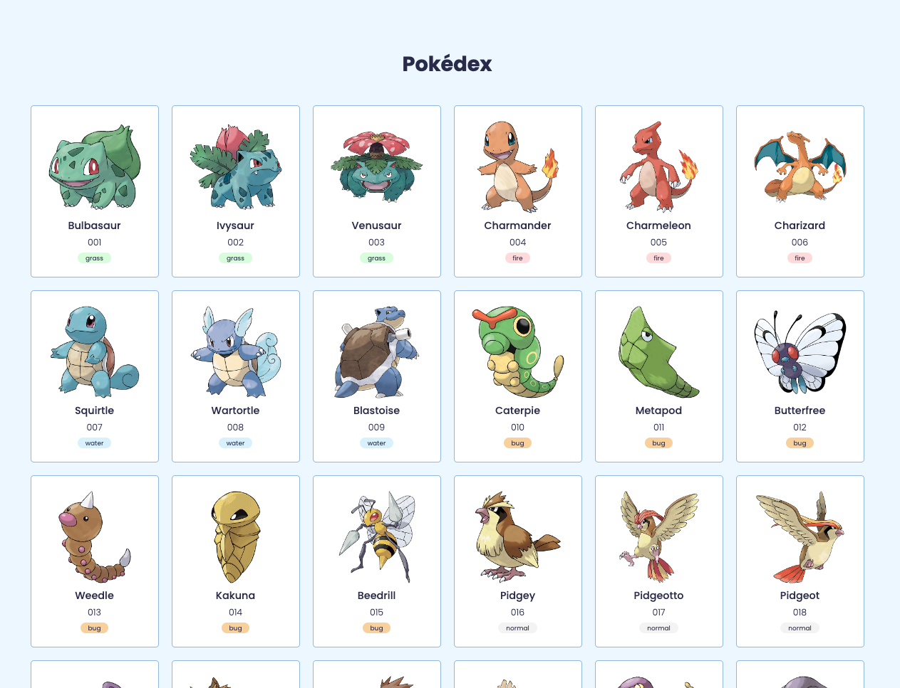

# JavaScript Pokédex

A cute Pokédex built with HTML, CSS, and JavaScript.



## Table of Contents

- [About](#about)
- [Features](#features)
- [Installation](#installation)
- [Contributing](#contributing)
- [License](#license)

## About

Learn how to use async and await in JavaScript by catching Pokemons.

## Features

- This project uses the RESTful Pokémon API [PokéApi](https://pokeapi.co/)

## Installation

1. Clone the repository:

   ```bash
   git clone https://github.com/yourusername/pokedex-javascript.git
   ```

2. Navigate to the project directory:

   ```bash
   cd pokedex-javascript
   ```

## Contributing

Pull requests are welcome. For major changes, please open an issue first to discuss what you would like to change.

## License

This project is licensed under the MIT License. See the [LICENSE](./LICENSE) file for details.
